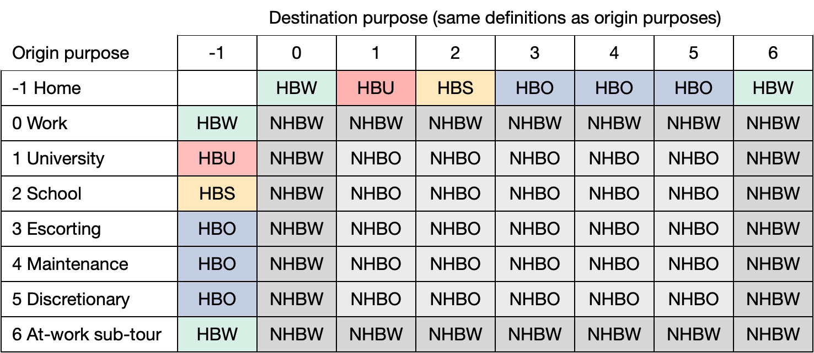

## Unlocking the mysteries in categorical data coded as integers

Without a doubt one of the most egregiously incompetent practices in transport
planning is the coding of categorical data using integers in survey data and
synthetic travel diaries. The useability and portability of the OahuMPO V6
modeling system and supporting data are badly crippled by this, and compounded
by the difficulty of finding their definitions. We will attempt to fill that gap
by collecting such definitions in this file for easy reference. Please cite the
specific location of where you eventually find the definitions in the writeups
that follow. Finally, if you're not great at coding tables in Markdown on the
fly please enter the data in this [excellent online table
generator](https://www.tablesgenerator.com/markdown_tables) and then paste the
creation below.

Several references will be used often and can be cited by acronyms:

+ FMR: Final Model Refresh Report, July 2013
+ TBTME: Tour-Based Travel Model Estimation for Oahu Metropolitan Planning Organization, June 2013
+ UGPM: User's Guide for the OahuMPO Planning Model in TransCAD 6.0, June 2013
+ OHTS: Oahu Household Travel Survey: Final Report, February 2013

### Time period definitions

The V6 resident tour-based model simulation clock begins at 0300 and ends at
0259 the following morning. Trips are scheduled in 30-minute bins sequentially
numbered from 1-48, giving rise to the following equivalencies:

| Acronym | Description    | Hours     | periods  |
|---------|----------------|-----------|----------|
| EA      | Early morning  | 0300-0559 | 1-6      |
| AM      | AM peak period | 0600-0859 | 7-12     |
| MD      | Mid-day period | 0900-1459 | 13-24    |
| PM      | PM peak period | 1500-1859 | 25-32    |
| NT      | Nighttime      | 1900-0259 | 0, 33-48 |

Summarizing these data by period is straightforward. However, if you want to
create hourly distributions you'll find that there are in fact 49 levels in the
`period` variable in trip records. A value of zero denotes a trip in motion when
the simulation begins. There are not many of these in the data, but they can be
assigned to the 0200 (2 AM) hour. Since the periods are numbered sequentially
from 0300 their conversion to starting hour requires a little more work. The
following code will develop an equivalency table in R that can then be merged
with the trip list by `period`:

```{r}
repeater <- c(2)  # Trips already in motion start in this hour
for (hour in 0:23) { repeater <- c(repeater, hour); repeater <- c(repeater, hour) }
temporal_offsets <- tibble(hour = repeater, period = c(0, 43:48, 1:42))
```

### Origin and destination purpose

The activities at the origin and destination can be used to classify trips (tour segments) by traditional home-based and non-home-based trip purposes. These data are coded as `originPurpose` and `destinationPurpose` in the trip list built from tour lists, as well as `ORIG_PURP` and `DEST_PURP` in some of the older model estimation scripts and data files. There are eight levels associated with these variables, ranging from -1 to 6. However, there is no reference anywhere to what these integer indices correspond to. By tracing through [ResidentTrip.java](https://github.com/wsp-sag/ompo_v6/blob/master/com/pb/ompo/residentmodel/ResidentTrip.java) in the V6 repo we infer that the purposes match a list of tour purposes in draft documentation that inexplicably never made it into the final version. The values of this variable appear to correspond to the following purposes:

| Code | Description                     |
|:----:|---------------------------------|
|  -1  | Home (tour anchor)              |
|   0  | Work                            |
|   1  | University/college              |
|   2  | School (K-12)                   |
|   3  | Escorting (transporting others) |
|   4  | Maintenance                     |
|   5  | Discretionary                   |
|   6  | At-work sub-tour                |

With this understanding we can map combinations of `originPurpose` and `destinationPurpose` to the trip purposes shown below. 



The trip purposes follow traditional definitions: home-based work (HBW), home-based university (HBU), home-based school (HBS), home-based other (HBO), work-related non-home-based (NHBW), and other non-home-based (NHBO) trips. If comparing these data to AirSage data only HBW, HBO (as an aggregation of other home-based purposes), and NHB are defined.

Strictly speaking a trip between home and at-work sub-tour is invalid:

```{r}
originPurpose == -1 & destinationPurpose == 6   # and vice-versa
```

If a traveler really did visit home during the middle of the day that would close the tour, with the return to the office (and presumably home again in the evening) coded as a second mandatory tour. In this case we assume that the original developers allowed that as an exception to traditional tour definition to simplify their handling in the model (i.e., obviating the need to run tour mode choice a second time, with possibility of choosing a different mode in the afternoon than they did in the morning).


### Mode

The following mode codes are used to define both the primary mode for tours and the mode for individual trips (tour segments). The `Mode` code was used in V6 model development and current applications, while the `trip_mode` identifier will be used in future updates. Note that the auto `trip_mode`s will include a `T` suffix for toll facilities, and that all multi-occupant vehicle are eligible to use HOV lanes.  

| Code | Mode         | trip_mode  | description                         |
|------|--------------|------------|-------------------------------------|
| 1    | sov_notoll   | sov        | Single occupancy auto               |
| 2    | sov_toll     | sov_T      | Single occupancy auto - toll        |
| 3    | hov2_notoll  | a2p        | Auto with 2 persons                 |
| 4    | hov2_toll    | a2p_T      | Auto with 2 persons - toll          |
| 5    | hov3_notoll  | a3p        | Auto with 3+ persons                |
| 6    | hov3_toll    | a3p_T      | Auto with 3+ persons - toll         |
| 7    | walk         | walk       | Walk                                |
| 8    | bike         | bike       | Bicycle                             |
| 9    | w_loc        | w_loc      | Walk access to local bus            |
| 10   | w_exp        | w_exp      | Walk access to express bus          |
| 11   | w_fg         | w_rail     | Walk access to rail                 |
| 12   | knr          | knr        | Kiss-n-ride transit access          |
| 13   | pnr_informal | pnr_i      | Informal park-n-ride transit access |
| 14   | pnr_formal   | pnr_f      | Formal park-n-ride transit access   |
| 15   | school_bus   | school_bus | School bus                          |

### Race

The following racial codes are found on the synthetic person records. The
categories line up with the PUMS data on which the synthetic data is based.

  * AIorAN: American Indian or Alaskan Native
  * HIorPI: Hawaiian or Pacific Islander

| Code | Race    |
|------|---------|
| 1    | White   |
| 2    | Black   |
| 3    | AIorAN  |
| 4    | Asian   |
| 5    | HIorPI  |
| 6    | Other   |
| 7    | TwoPlus |

These were determined by comparing the synthetic population racial distribution
back to the PUMS data and infering.
